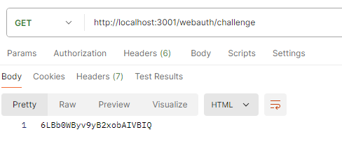

# FIDO2 Server 

簡單的測試範例


## 先決條件

* 必須安裝 docker

    https://www.docker.com/

* 學會如何使用Postman

    https://www.postman.com/


## How to use

-d 是背景執行的意思
```
    docker-compose up -d 
```

系統移除
```
    docker-compose down -v 
```

系統重新建置

```
    docker-compose build 
    docker-compose up -d 
```

## 路徑及API

Server 根目錄 GET  : http://localhost:3001

取得challenge GET :  http://localhost:3001/webauth/challenge




註冊 : POST http://localhost:3001/webauth/register

需要傳送給Server 的資料：

```
{
  "type": "public-key",
  "id": "pUhPDlqn_vXGAMAdN_J1kplvPx2DEkpVxZcMzze5i9g",
  "rawId": "pUhPDlqn_vXGAMAdN_J1kplvPx2DEkpVxZcMzze5i9g=",
  "authenticatorAttachment": "cross-platform",
  "clientExtensionResults": {},
  "response": {
    "attestationObject": "o2NmbXRmcGFja2VkZ2F0dFN0bXSjY2FsZyZjc2lnWEcwRQIhAIoo1sZX6TSLU5_DfUY3MaqryceKd2z0mlPCeut_t53-AiBILQ9NVKW4mpDg8X2cIMsmJrA61hL_W5Lr9am9hGqYa2N4NWOBWQIHMIICAzCCAaigAwIBAgIEAcAAADAKBggqhkjOPQQDAjBiMQswCQYDVQQGEwJTRTESMBAGA1UECgwJQVRLZXlDQTAwMSIwIAYDVQQLDBlBdXRoZW50aWNhdG9yIEF0dGVzdGF0aW9uMRswGQYDVQQDExJBdXRoZW50cmVuZCBDQSAwMDAwIBcNMjEwMzA5MTEzNTA1WhgPMjA2MTAyMjcxMTM1MDVaMGcxCzAJBgNVBAYTAlRXMRQwEgYDVQQKDAtBdXRoZW5UcmVuZDEiMCAGA1UECwwZQXV0aGVudGljYXRvciBBdHRlc3RhdGlvbjEeMBwGA1UEAwwVQVRLZXkuUHJvIFNOIDAxQzAwMDAwMFkwEwYHKoZIzj0CAQYIKoZIzj0DAQcDQgAEF1mVPfYR1zxfjxIlkHnW-Nth5yQPEWJFt3-JsngkYhwv0kA2wCIz96G-NBHlaiI8Oaj878MTGnxI6sRjgffmX6NFMEMwEwYLKwYBBAGC5RwCAQEEBAMCBSAwIQYLKwYBBAGC5RwBAQQEEgQQ4alhg1AWTyS1W-OuI2FMxjAJBgNVHRMEAjAAMAoGCCqGSM49BAMCA0kAMEYCIQC2ffKU9u0Z6ovCUdNo7Sq5aa7T_-iSt0GZbhpCZX58RQIhAIsYgMsCct4WgiiZi3eYUmd8dkumfz2bi-X8INz9Cr3CaGF1dGhEYXRhWLJPsghW8kpq59r8J4EJCshHeubivQcmYCNsxhTG-3wuoMUAAAIN4alhg1AWTyS1W-OuI2FMxgAgpUhPDlqn_vXGAMAdN_J1kplvPx2DEkpVxZcMzze5i9ilAQIDJiABIVgg_LQRHDBnE_n1TDz4bqB0cT1WjAyH9DO4jYMhcQ8FUAgiWCDuwhR7Umu4TiuFy26L97eVMgn1TSmuq2cg4aOTL_1i06FrY3JlZFByb3RlY3QD",
    "authenticatorData": "T7IIVvJKaufa_CeBCQrIR3rm4r0HJmAjbMYUxvt8LqDFAAACDeGpYYNQFk8ktVvjriNhTMYAIKVITw5ap_71xgDAHTfydZKZbz8dgxJKVcWXDM83uYvYpQECAyYgASFYIPy0ERwwZxP59Uw8-G6gdHE9VowMh_QzuI2DIXEPBVAIIlgg7sIUe1JruE4rhctui_e3lTIJ9U0prqtnIOGjky_9YtOha2NyZWRQcm90ZWN0Aw==",
    "clientDataJSON": "eyJ0eXBlIjoid2ViYXV0aG4uY3JlYXRlIiwiY2hhbGxlbmdlIjoiTm1VOHYxU1FrZklETmI5T1FFcGxNelZCIiwib3JpZ2luIjoiaHR0cHM6Ly93ZWJhdXRobi5wYXNzd29yZGxlc3MuaWQiLCJjcm9zc09yaWdpbiI6ZmFsc2V9",
    "publicKey": "MFkwEwYHKoZIzj0CAQYIKoZIzj0DAQcDQgAE_LQRHDBnE_n1TDz4bqB0cT1WjAyH9DO4jYMhcQ8FUAjuwhR7Umu4TiuFy26L97eVMgn1TSmuq2cg4aOTL_1i0w==",
    "publicKeyAlgorithm": -7,
    "transports": [
      "usb"
    ]
  },
  "user": {
    "id": "id-for-test",
    "name": "test"
  }
}
```

登入： POST http://localhost:3001/webauth/login

需要傳送給Server的資料
```
    {
        "username" : "test1",
        "userinfo" : "測試範例",
        "clientExtensionResults": {},
        "id": "XZg7VBiVGFZzHmC4OrTXNQ",
        "rawId": "XZg7VBiVGFZzHmC4OrTXNQ==",
        "type": "public-key",
        "authenticatorAttachment": "platform",
        "response": {
            "authenticatorData": "T7IIVvJKaufa_CeBCQrIR3rm4r0HJmAjbMYUxvt8LqAdAAAAAA==",
            "clientDataJSON": "eyJ0eXBlIjoid2ViYXV0aG4uZ2V0IiwiY2hhbGxlbmdlIjoiYmYxOWQ3ZjktZjk3ZS00NjEyLTg0MjYtNDYwZTExZmExOTBmIiwib3JpZ2luIjoiaHR0cHM6Ly93ZWJhdXRobi5wYXNzd29yZGxlc3MuaWQiLCJjcm9zc09yaWdpbiI6ZmFsc2V9",
            "signature": "MEYCIQC1FA7k7j7zf50ar9STzkanna16IkZdIYHwLNeWYWxCRwIhAITEOUcqnMC9_EHmjRxzoq3K-Titr3nWSZKY9n1yC_cL",
            "userHandle": "ZDUzMGYxMGQtZmI2ZS00ZjdkLTgzMTMtZWQ5N2QzYTU2ZDQ4"
        }
    }
```

## 疑難排解

* 注意 origin : 
    
    本範例是使用github 上的，因此origin 可能會有所不同，注意你的clientData 產生的 origin 是否與server 相同(可能需要改動server資訊)

    位置 ：　routes/webauth.js/

* 注意 challenge :

    會先GET challenge ，然後拿著challenge 去註冊，回傳會去驗證challenge 是否相同。
    目前是給定值：NmU8v1SQkfIDNb9OQEplMzVB


## 相關參考：
https://webauthn.passwordless.id/registration/


